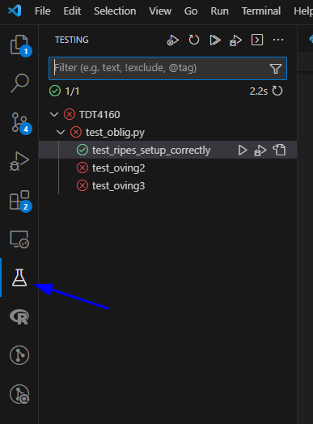

# README

## Prerequisites
Python needs to be installed.

## Installation

Install required python libraries:
```pip install -r requirements.txt```

Install Ripes:
```python get_ripes.py```

If you are on Windows, you should have a folder named "Ripes.zip".

If you are in vscode, right click and press; *Reveal in File Explorer*.


Unzip to the same folder that this as this repository.


You should now be able to run tests from vscode:



First, run the test called `test_ripes_setup_correctly`. If this fails, something wrong happened with the setup of Ripes, possible fix for this is to install Ripes manually from [here](https://github.com/mortbopet/Ripes/releases/tag/v2.2.6). And update the value `RIPES_PATH` to the paht for your Ripes installation. (This needs to be an [absolute path](https://www.computerhope.com/issues/ch001708.htm)).

To test your "Øving". Add your assembly file to the "Øvinger" folder, you should now be able to test your code using visual studio.